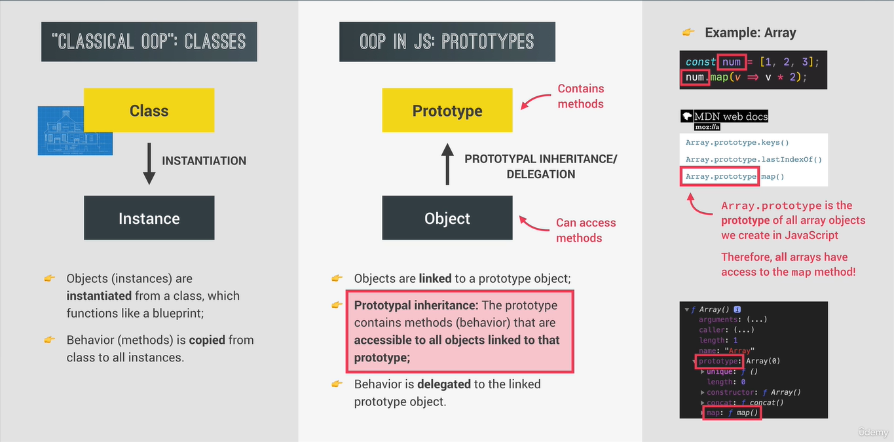
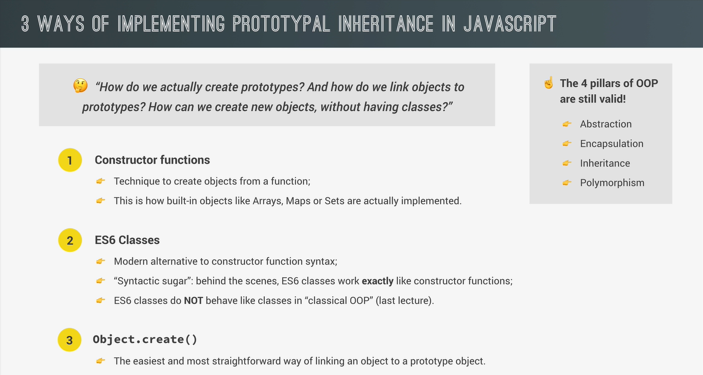

# OOPs in JavaScript

### What is a class?

A class is like a _theoritical blue print_ that we use to build many houses in the real world. In the same way theoritical class can be used to create objects also called instances, which we can then use in our code.

### What are objects

**Objects(instances) are instantiated from a class, which functions like a blueprint.** Objects are linked to a certain prototype object. So we say that each object has a prototype. 

### What are prototypes?

**The prototype object contains _methods and properties that all the objects that are linked to it can access and use._ This behavious is called _prototypal inheritance_.**

So again prototypal inheritance means that all objects, that are linked to a certain prototype object can use the methods and properties that are defined on that prototype.

So, objects inherit methods and properties from the prototype which is the reason why this mechanism is called prototypal inheritance. 

## Classical OOP and OOP in JS

*Note:  _This is different from one class inheriting another class._ But in this case, it's basically an instance inheriting from a class.

Object *delegate* behaviour to the linked prototype object. And behaviour is just another term for methods here. Besides prototypal inheritance, we also call this method - **Delegation**

### Does JavaScript has classes?

 Yes JavaScript has classes. This feature was introduced with ECMAScript 2015 specification. However, it's important to note that JavaScript is primarily a prototype-based language, and it's classes are primarily syntactical sugar over the existing prototype-based inheritance mechanisms. In other words it provides a more familiar syntax for developers coming from class-based language like Java and C++, but under the hood it works somewhat differently.

 Source: ChatGPT & Udemy